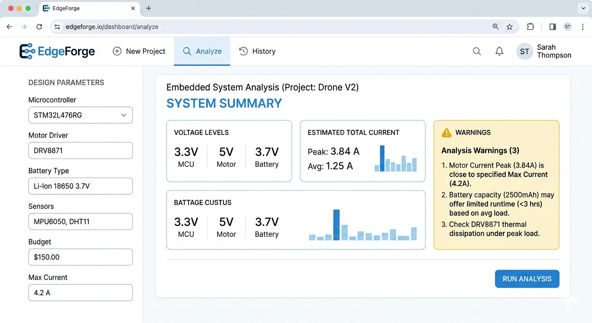

# EdgeForge-AMD-Slingshot
AI-powered engineering copilot for embedded systems and power electronics, optimized for AMD Ryzen AI.

**EdgeForge** is a physics-grounded AI assistant designed to help hardware engineers and students design reliable embedded systems. By leveraging the **AMD Ryzen AI** ecosystem, EdgeForge provides real-time, private, and deterministic design critiques to prevent hardware failures before they happen.

---

## 🚀 The Vision
Most hardware failures are preventable. EdgeForge acts as a "Virtual Senior Mentor," analyzing power integrity, thermal constraints, and component compatibility to ensure your prototype works on the first "power-on."

## 🧠 Key Features
- **Design Critic Mode:** Validates component selections and power architectures.
- **Failure Predictor:** Identifies risks like brownouts, inrush current, and thermal throttling.
- **Private Design Mode:** Powered by **AMD Ryzen AI (XDNA)** to keep proprietary schematics local and secure.

## 🛠️ Technical Architecture
 (CONCEPTUAL)
EdgeForge uses a multi-layered approach to ensure engineering accuracy:
1. **Input Parser:** Extracts constraints from user system descriptions.
2. **Engineering Knowledge Engine:** A deterministic rule-based layer (Power/Thermal/Electrical).
3. **LLM Reasoning Layer:** Optimized via **Vitis AI** for local execution on AMD NPUs.

## 📅 Roadmap
- [ ] **Phase 1:** Component Database Curation (AMD Kria, STM32, Power ICs).
- [ ] **Phase 2:** Core Logic & Constraint Engine development (Python/FastAPI).
- [ ] **Phase 3:** Local LLM Quantization for AMD Ryzen AI.
- [ ] **Phase 4:** KiCad/Altium Plugin Integration.

---
**Team:** HACKER405  
**Built for:** AMD Slingshot Challenge 2024
